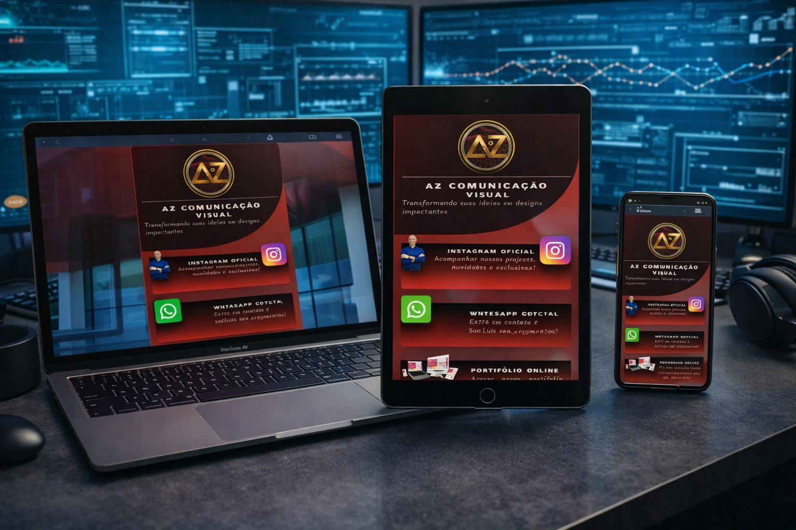

# AZ Comunicação Visual - Link na Bio

## 🚀 Apresentação do Projeto

Imagine uma vitrine digital que reúne todas as conexões mais valiosas da sua marca em uma só página. Essa é a proposta do Link na Bio da AZ Comunicação Visual: uma experiência de contato instantâneo, elegante e persuasiva para transformar visitantes em clientes.

Construído com um visual premium, essa landing page funciona como um hub profissional para Instagram, WhatsApp, localização e portfólio online. É a solução ideal para quem quer impressionar, gerar leads e facilitar a comunicação com público local e remoto.

## ✨ Benefícios do produto

- 📱 Conexão imediata com os canais de vendas: Instagram e WhatsApp em destaque.
- 🌍 Direciona seu cliente diretamente para sua localização física com um clique.
- 💼 Valoriza sua marca com portfólio online organizado e visual impactante.
- 🎥 Imersão reforçada por vídeo de fundo que mantém a atenção e transmite qualidade.
- ⚡ Navegação suave graças à animação de entrada em cascata e interações modernas.

## 🎯 Por que usar este Link na Bio?

- A página concentra os principais pontos de contato em uma única experiência.
- Cria credibilidade imediata através de design profissional e identidade visual forte.
- Facilita a conversão de visitantes em clientes com acesso rápido e intuitivo.
- Ideal para profissionais criativos, empreendedores e marcas que querem se destacar no digital.

## 🧩 Tecnologias utilizadas

- HTML5
- Tailwind CSS via CDN
- JavaScript puro
- Vídeo de fundo localizado em `assets/bg.webm`

## 📁 Estrutura do projeto

- `index.html` - página principal do Link na Bio
- `script.js` - lógica de animações dos cards
- `assets/` - imagens, vídeo e ícones utilizados na apresentação

## ⚡ Como apresentar este produto

1. Abra `index.html` em um navegador moderno.
2. Mostre o visual impactante com o vídeo de fundo e a área de perfil.
3. Destaque cada card como um canal de vendas estratégico.

## 🧑‍💻 Autor

Geilson Freire - Engenheiro de software fullStack!
